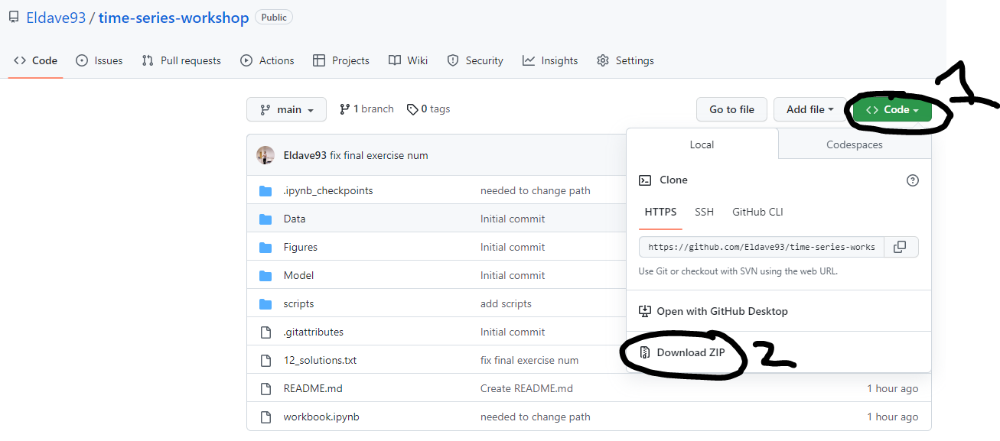

# time-series-workshop
To download this notebook, please click on the Green code button, and then download zip

Once you have this in your downloads, move this to the location on your computer where you want to run the notebook, unzip it, then open the notebook using anaconda.

To use a cloud version of this notebook, click below:

You can save your version of the notebook to your google drive.
